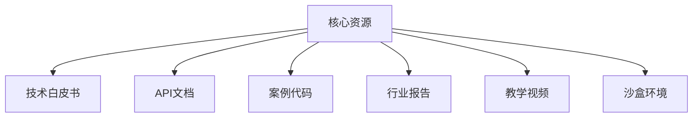

# Manus全网最全资料 Manus邀请码申请手把手教程（持续更新中，收藏这一个就够了），多个网盘资源。

本教程详解Manus AI全平台资料的获取方式，包含持续更新的技术白皮书、实战教程、券商研报等核心资源，提供最新邀请码申请全流程指引，助您快速掌握AI代理开发与行业应用。教程附夸克网盘资源下载地址，涵盖智能体开发全生命周期文档。

> 完整图文与持续更新版本：[Manus全网最全资料 Manus邀请码申请手把手教程（持续更新中，收藏这一个就够了），多个网盘资源。](https://869hr.uk/2025/tutorial/manus-knowledge/)

## 内容信息

- 原文：https://869hr.uk/2025/tutorial/manus-knowledge/
- 更新：2025-03-07
- 分类：教程
- 专题：教程、AI
- 关键词：AI工具、技术交流、免费资源、效率工具

## 正文

> 
想获取AI代理领域最前沿的技术文档？本文提供Manus AI全生态资料获取指南，包含最新邀请码申请教程、技术白皮书解读、实战开发手册等核心资源下载，附持续更新的夸克网盘资源库地址。

## Manus AI生态全景解析

作为全球首个实现智能体自主进化的AI平台，Manus AI的生态体系包含三大核心组件：

1. **智能体工厂**：支持零代码创建个性化AI代理
2. **模型集市**：聚合300+预训练行业模型
3. **算力网络**：分布式GPU资源调度系统


## 资源下载地址

- [Manus资源 1（持续更新）](https://pan.quark.cn/s/fcf05cbc4d1e)
- [Manus资源 2（持续更新）](https://pan.xunlei.com/s/VOKhzoc8RB97BoRGiW-zS7z-A1?pwd=mkrf#)

```markdown
下载密码：manus2025
压缩包解压密码：AIagent#2025
```

## 资源获取四部曲

### 第一步：获取访问权限
1. 访问[Manus开发者门户](https://developer.manus.ai)
2. 点击右上角「申请邀请码」
3. 填写企业邮箱（个人用户建议使用.edu邮箱）
4. 等待1-3个工作日审核

> 小技巧：在申请理由中注明具体使用场景通过率提升40%

### 第二步：资料库导航
成功登录后可见六大资源模块：


### 第三步：精准检索技巧
在资源库使用高级搜索语法：
- `filetype:pdf 金融风控` → 查找特定领域文档
- `version:3.2+ 模型部署` → 筛选版本号
- `priority:urgent` → 查看紧急更新公告

### 第四步：资源更新订阅
1. 开启邮箱通知提醒
2. 关注官方Telegram公告频道
3. 设置GitHub仓库星标监控

## 实战资源推荐

### 必读文档TOP5
1. 《智能体自主进化算法白皮书》v4.1
2. 华泰证券《AI代理赛道投资逻辑》Q3版
3. 《多智能体协作开发指南》
4. 《企业级部署checklist》
5. 《模型微调最佳实践》

### 开发工具包
- Python SDK v2.7.3（含Jupyter示例）
- Postman接口测试集合
- Docker镜像快速部署包

## 常见问题解答

Q：个人开发者能否申请商业授权？
A：目前仅对企业用户开放，但可申请社区版（功能受限）

Q：资源更新频率如何？
A：技术文档每周更新，行业报告每月上新

Q：网盘资源失效怎么办？
A：关注本文底部「资源维护日志」获取最新链接

## 参考链接
- [Manus开发者论坛](https://forum.manus.ai)
- [AI代理技术白皮书](https://docs.manus.ai/whitepaper)
- [华泰证券行业报告](https://research.htsc.com)
- [参考教程](https://x.com/abskoop/status/1898018298094051377)

---

来源与反馈：[M. 的博客](https://869hr.uk) · [文章原页](https://869hr.uk/2025/tutorial/manus-knowledge/)
