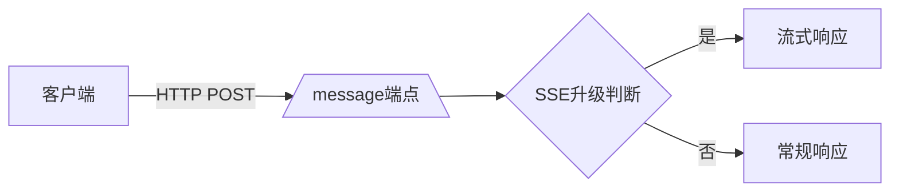
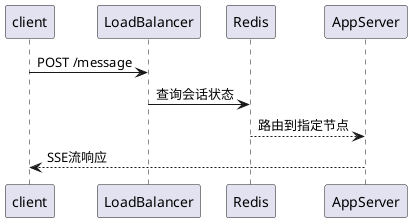

# MCP支持流式HTTP传输协议解析：构建下一代无状态服务架构

深入解析Model Context Protocol最新引入的可流式HTTP传输机制，详解其如何通过改进SSE实现无状态服务架构，对比WebSocket方案的技术选型考量，并给出三种典型服务器实现场景的工程实践方案。全文包含协议演进动机、技术优势解读及实际应用场景演示。

> 完整图文与持续更新版本：[MCP支持流式HTTP传输协议解析：构建下一代无状态服务架构](https://869hr.uk/2025/tech/mcp-http-sse-update/)

## 内容信息

- 原文：https://869hr.uk/2025/tech/mcp-http-sse-update/
- 更新：2025-03-17
- 分类：技术
- 专题：技术、AI
- 关键词：网络工具、VPS

## 正文

> **David Wheeler, 计算机科学先驱**
> 
"计算机科学中的每个问题都可以通过增加一个间接层来解决——除了间接层太多的问题本身。"

## 协议演进背景

传统HTTP+SSE传输存在三大技术痛点：
1. **连接脆弱性**：长连接易受网络波动影响
2. **状态强依赖**：服务器需维持会话状态
3. **协议割裂**：客户端消息需通过独立端点传输

新版MCP协议通过以下架构调整实现突破：


## 核心技术特性

### 传输层重构
1. **端点精简**：移除专用/sse端点
2. **消息聚合**：所有客户端请求通过/message端点处理
3. **智能升级**：服务端动态决定SSE流式响应

### 会话管理革新
```python
# 客户端请求示例
headers = {
    "Mcp-Session-Id": "8a7d6f5e-4c3b-2a1f",
    "Content-Type": "application/json"
}
```

## 三大实现模式对比

### 无状态服务器
```javascript
// 工具调用响应示例
{
  "jsonrpc": "2.0",
  "id": 123,
  "result": {
    "tool_output": "处理完成",
    "metadata": {"duration": "2.3s"}
  }
}
```

### 流式无状态服务
1. 接收POST请求时触发SSE升级
2. 通过事件流发送进度通知
3. 最终以CallToolResponse结束流

### 有状态集群方案


## 技术选型深度解析

### 弃用WebSocket的三大考量
1. **协议开销**：WS握手过程增加延迟
2. **浏览器限制**：无法自定义请求头
3. **方法约束**：仅支持GET方法升级

### SSE方案优势矩阵
| 特性                | HTTP+SSE | WebSocket |
|---------------------|----------|-----------|
| 标头定制能力        | ✓        | ✗         |
| 无状态实现          | ✓        | ✗         |
| 基础设施兼容性      | ✓        | △         |
| 双向通信效率        | △        | ✓         |

## 工程实践建议

### 部署模式选择指南
1. **工具型服务**：推荐纯无状态模式
2. **实时分析系统**：采用流式无状态架构
3. **企业级应用**：选择有状态集群部署

### 客户端最佳实践
```bash
# 启动SSE监听流
curl -H "Mcp-Session-Id: <SESSION_ID>" https://api.example.com/message
```

## 未来演进方向
1. 分块传输编码(Chunked Transfer)优化
2. QUIC协议适配方案
3. 边缘计算场景下的传输优化

## 参考链接
- [MCP协议规范PR#206](https://github.com/modelcontextprotocol/specification/pull/206)
- [IANA媒体类型注册](https://www.iana.org/assignments/media-types/)
- [Mozilla SSE文档](https://developer.mozilla.org/en-US/docs/Web/API/Server-sent_events)

---

来源与反馈：[M. 的博客](https://869hr.uk) · [文章原页](https://869hr.uk/2025/tech/mcp-http-sse-update/)
