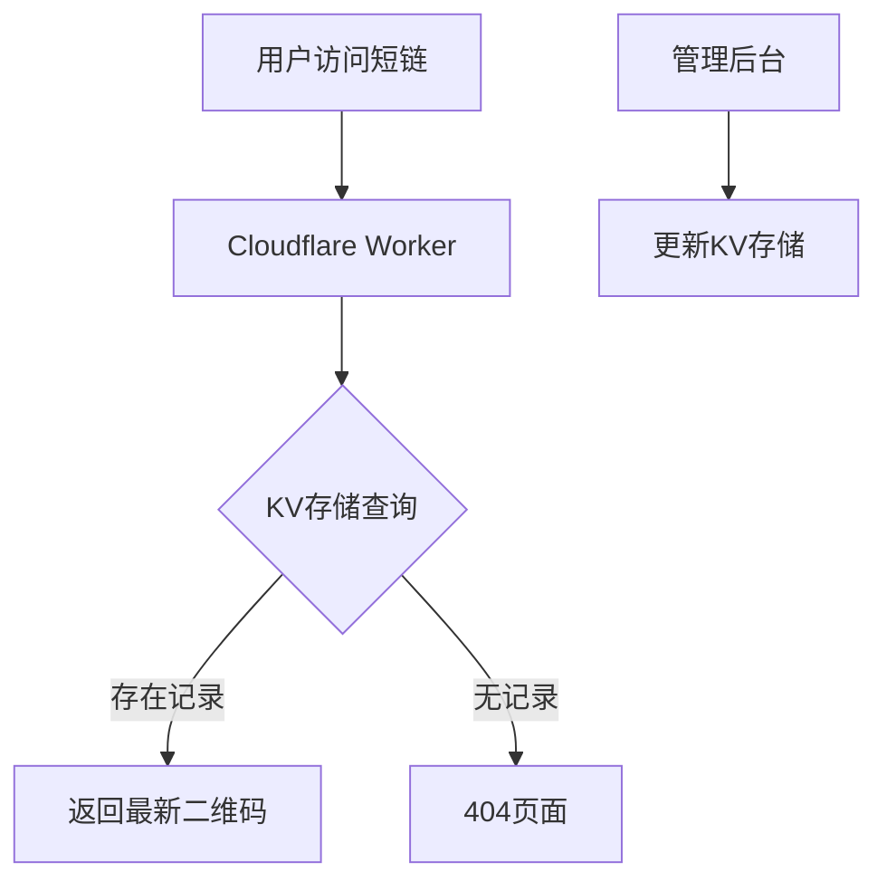

# 微信群永久二维码生成工具指南 | 2025最新版

本文详细介绍如何利用Cloudflare Workers和KV存储开发无需服务器的微信群永久二维码生成工具，支持自定义样式、密码保护和实时更新，包含完整部署教程和功能扩展建议，帮助开发者快速构建稳定的社群管理工具。

> 完整图文与持续更新版本：[微信群永久二维码生成工具指南 | 2025最新版](https://869hr.uk/2025/tutorial/qrcode-generate/)

## 内容信息

- 原文：https://869hr.uk/2025/tutorial/qrcode-generate/
- 更新：2025-03-16
- 分类：教程
- 专题：教程
- 关键词：微信、效率工具、Cloudflare、开发工具

## 正文

> **李开复, 《AI未来进行式》**
> 
"真正的创新往往诞生于解决日常痛点的过程中。"

## 开发背景

在2025年的今天，微信月活用户已突破15亿，但群二维码7天自动失效的机制仍是社群运营者的痛点。笔者通过Cloudflare Workers + KV存储的serverless方案，实现了：

1. 永久有效的智能跳转短链
2. 可视化后台管理界面
3. 密码保护等企业级功能
4. 日均百万级请求承载能力

## 核心架构解析

### 技术栈全景图


### 关键技术指标
- **响应速度**: <200ms（全球边缘节点加速）
- **存储容量**: 每个命名空间支持10GB数据
- **请求处理**: 每天100,000次免费请求额度
- **安全机制**: HMAC签名验证 + 密码保护双层防护

## 快速部署指南

### 前置准备
1. 注册[Cloudflare账号](https://dash.cloudflare.com/)
2. 安装[Wrangler CLI工具](https://developers.cloudflare.com/workers/wrangler/)
3. 准备微信最新版（建议8.0.25+）

### 部署步骤
```bash
# 克隆项目仓库
git clone https://github.com/wlzh/serverless-qrcode-hub

# 安装依赖
npm install

# 登录Cloudflare
wrangler login

# 部署Worker
wrangler deploy
```

## 进阶功能配置

### 自定义样式模板
在`/templates`目录下修改HTML文件：
```html
<!-- 示例：深色模式模板 -->
<div class="qrcode-container dark-mode">
  
  <h2>{{title}}</h2>
  <div class="qrcode-wrapper">
    {{> qrcode}}
  </div>
</div>
```

### 密码保护实现
```javascript
// 在Worker脚本中添加验证逻辑
async function handlePassword(request) {
  const authHeader = request.headers.get('Authorization');
  const [username, password] = atob(authHeader.split(' ')[1]).split(':');
  return await KV_NAMESPACE.get(`auth_${username}`) === password;
}
```

## 应用场景扩展

### 商业案例参考
1. **教育机构**: 为不同班级创建独立短链
2. **电商运营**: 按商品品类分组管理
3. **活动管理**: 分会场二维码动态更新
4. **企业内网**: 部门通讯录安全访问

## 性能优化建议

1. **缓存策略**: 设置`Cache-Control: public, max-age=300`
2. **图片压缩**: 使用WebP格式减少30%传输体积
3. **地域路由**: 根据用户IP自动选择最近节点
4. **监控报警**: 配置[Cloudflare Analytics](https://dash.cloudflare.com/analytics)

## 常见问题排查

| 现象 | 解决方案 |
|------|----------|
| 404错误 | 检查KV存储键值是否匹配 |
| 样式错乱 | 验证HTML模板语法 |
| 认证失败 | 确认密码字段base64编码正确 |
| 更新延迟 | 检查KV存储写入权限 |

## 未来演进方向

1. **智能识别系统**
   - OCR自动解析群二维码
   - 过期预警邮件通知
   - AI推荐最佳更新时间

2. **生态集成**
   - 微信开放平台API对接
   - 钉钉/飞书多平台支持
   - 小程序管理端开发

> **Linus Torvalds**
> 
"好的程序员关心代码结构，伟大的程序员关注数据结构。" 

## 参考链接
- [项目GitHub仓库](https://github.com/wlzh/serverless-qrcode-hub)
- [Cloudflare Workers文档](https://developers.cloudflare.com/workers/)

---

来源与反馈：[M. 的博客](https://869hr.uk) · [文章原页](https://869hr.uk/2025/tutorial/qrcode-generate/)
